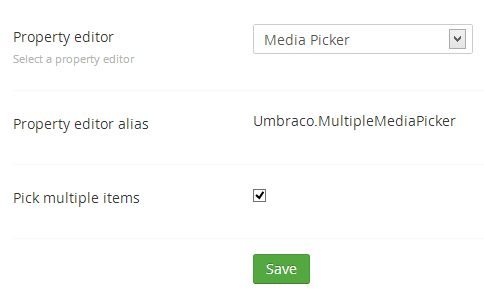

#Property Editors#

A Property Editor is the editor that a Data Type references. A Data Type is defined by a user in the Umbraco backoffice and references a Property Editor. In Umbraco v6 (and v4) a Property Editor is defined in C# by a developer and compiled into a DLL. In Umbraco v7 a Property Editor is defined in a JSON manifest file and associated JS files.

When creating a data type, you specify the property editor for the data type to use by selecting from the "property editor" list (as shown below)

### Umbraco v7 Data Type definition

### Umbraco v6 (and v4) Data Type definition

## [How to use Property Editors](Using-Property-Editors/index.md) ##

## [Built-in Property Editors in v7](Built-in-Property-Editors-v7/index.md) ##
Umbraco comes preinstalled with many useful property editors...

## [Built-in Property Editors in v6 (and v4)](Built-in-Property-Editors/index.md) ##
Umbraco comes preinstalled with many useful property editors...

## [How to create a Property Editor](../../../Extending-Umbraco/Property-Editors/index.md) ##
Creating property editors for Umbraco v7 and v6