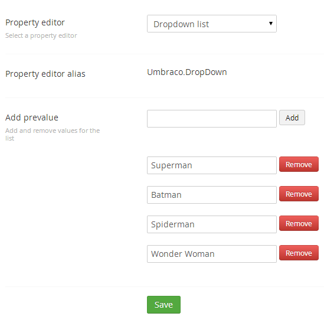

#Dropdown List

`Returns: String`

Displays a list of preset values. The value saved is a text value.

##Settings

###Prevalues
You can add, edit & delete the data prevalues rendered within the dropdown list.

##Data Type Definition Example

##Content Example 

##MVC View Example to output selected value

###Typed:

    @if (Model.Content.HasValue("superHero"))
    {
        
@Model.Content.GetPropertyValue("superHero")

    }

###Dynamic:     
                         
    @if (CurrentPage.HasValue("superHero"))
    {
        
@CurrentPage.superHero

    }    

##MVC View Example list all nodes which have a certain item selected in the dropdown list

###Typed:

    @{
        var valueToMatch = "SuperMan";
        //Get the first node inside the root
        var firstTypedContentAtRoot = Umbraco.TypedContentAtRoot().FirstOrDefault();
        if (firstTypedContentAtRoot != null)
        {
            var articles = firstTypedContentAtRoot.Children.Where(x => x.HasValue("superHero") && x.GetPropertyValue<string>("superHero").ToLower().Contains(valueToMatch.ToLower()));
            if (articles.Any())
            {
                
Pages with @valueToMatch selected:

                <ul>
                    @foreach (var page in articles)
                    {
                        <li><a href="@page.Url"> @page.Name</a></li>
                    }
                </ul>
            }
        }
    }

###Dynamic:                             

    @{
		var valueToMatch = "SuperMan";
        //Get the first node inside the root
        var firstContentAtRoot = Umbraco.ContentAtRoot().FirstOrDefault();
        if (firstContentAtRoot != null)
        {
            var articles = firstContentAtRoot.Children.Where("superHero.ToLower() == @0", valueToMatch.ToLower());
            if (articles.Any())
            {
                
Pages with @valueToMatch selected:

                <ul>
                    @foreach (var page in articles)
                    {
                        <li><a href="@page.Url"> @page.Name</a></li>
                    }                      
                </ul>
            }
        }
    }

