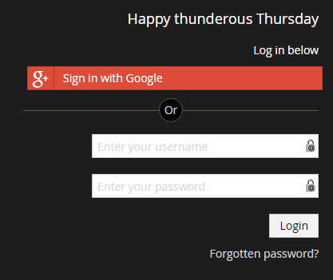

# Security
**Applies to version 7.3.1 and newer**

_This section describes how authentication & authorization works in Umbraco_

## Back office users

 Authentication for back office users in Umbraco uses [ASP.Net Identity](http://www.asp.net/identity) which is a very flexible and extensible framework for authentication. 
 
Out of the box Umbraco ships with a custom ASP.Net Identity implementation which uses Umbraco's database data. Normally this is fine for most Umbraco developers
but in some cases the authentication process needs to be customized. ASP.Net Identity can be easily extended by using custom OAuth providers which is helpful if you want
your users to authenticate with a custom OAuth provider like Azure Active Directory, or even Google accounts. ASP.Net identity is also flexible enough for you to override/replace 
any part of the process of authentication.

### Custom OAuth providers

The Umbraco back office supports custom OAuth providers for performing authentication of your users. For example: Any OpenIDConnect provider such as Azure Active Directory or Identity Server, Google, Facebook, Microsoft Account, etc...

To install and configure a custom OAuth provider you should use the Identity Extensions package: [https://github.com/umbraco/UmbracoIdentityExtensions](https://github.com/umbraco/UmbracoIdentityExtensions)

The installation of these packages will install snippets of code with readme files on how to get up and running. Depending on the provider you've configured and it's caption/color, the end result will look similar to:

### Replacing the basic username/password check

Having the ability to simply replace the logic to validate a username and password against a custom data store is important to some developers. Normally in ASP.Net Identity this
would require you to override the `UmbracoBackOfficeUserManager.CheckPasswordAsync` implementation and then replace the `UmbracoBackOfficeUserManager` with your own class during startup. 
Since this is a common task we've made this process a lot easier with an interface called `IBackOfficeUserPasswordChecker`.

Here are the steps to specify your own logic for validating a username and password for the back office:

1. Install the UmbracoIdentityExtensions package https://github.com/umbraco/UmbracoIdentityExtensions 

1. Create an implementation of `Umbraco.Core.Security.IBackOfficeUserPasswordChecker`

	* There is one method in this interface: `Task<BackOfficeUserPasswordCheckerResult> CheckPasswordAsync(BackOfficeIdentityUser user, string password);`
	* The result of this method can be 3 things:
		* ValidCredentials = The credentials entered are valid and the authorization should proceed
		* InvalidCredentials = The credentials entered are not valid and the authorization process should return an error
		* FallbackToDefaultChecker = This is an optional result which can be used to fallback to Umbraco's default authorization process if the credentials could not be verified by your own custom implementation

	For example, to always allow login when the user enters the password `test` you could do:
	
		using System.Threading.Tasks;
		using Umbraco.Core.Models.Identity;
		using Umbraco.Core.Security;
		
		namespace MyNamespace
		{
		    public class MyPasswordChecker : IBackOfficeUserPasswordChecker
		    {
		        public Task<BackOfficeUserPasswordCheckerResult> CheckPasswordAsync(BackOfficeIdentityUser user, string password)
		        {
		            var result = (password == "test") 
		                ? Task.FromResult(BackOfficeUserPasswordCheckerResult.ValidCredentials)
		                : Task.FromResult(BackOfficeUserPasswordCheckerResult.InvalidCredentials);
		
		            return result;
		        }
		    }
		}

1. Modify the `~/App_Start/UmbracoCustomOwinStartup.cs` class

	* Replace the `app.ConfigureUserManagerForUmbracoBackOffice` call with a custom overload to specify your custom `IBackOfficeUserPasswordChecker`  

            var applicationContext = ApplicationContext.Current;
            app.ConfigureUserManagerForUmbracoBackOffice<BackOfficeUserManager, BackOfficeIdentityUser>(
                applicationContext,
                (options, context) =>
                {
                    var membershipProvider = Umbraco.Core.Security.MembershipProviderExtensions.GetUsersMembershipProvider().AsUmbracoMembershipProvider();
                    var userManager = BackOfficeUserManager.Create(options, 
                        applicationContext.Services.UserService,
                        applicationContext.Services.ExternalLoginService,
                        membershipProvider);
                    //Set your own custom IBackOfficeUserPasswordChecker   
                    userManager.BackOfficeUserPasswordChecker = new MyPasswordChecker();
                    return userManager;
                });	
                
1. Make sure to switch the `owin:appStartup` appSetting in your `web.config` file to use `UmbracoCustomOwinStartup`: `<add key="owin:appStartup" value="UmbracoCustomOwinStartup"/>`

**Note:** if the username entered in the login screen does not exist in Umbraco then `MyPasswordChecker()` does not run, instead Umbraco will immediately fall back to it's internal checks (default Umbraco behavior).
