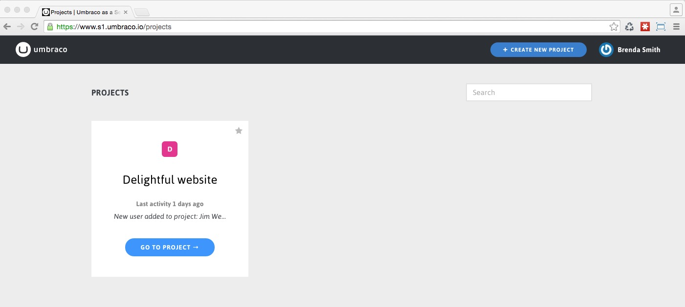

#Welcome to Umbraco Cloud
We're excited you have decided to use Umbraco Cloud!

##What's up with the name Umbraco Cloud?
Since Umbraco Cloud _is_ Umbraco we thought we'd stick with a name that describes what it is. So there you go.

## Projects and Environments
In Umbraco Cloud we organize your work into projects which are made of environments, teams, settings, and other related resources like databases and file storage. A project is comprised of two environments, _development_ and _live_. If needed a project based on the _Support_ plan can have an additional staging environment so the structure is _development_, _staging_ and _live_.

####Set up and Code
For developers, you will use the development environment to set up the site. To create and test code, clone _development_ to your local machine and then, once things are just how you like, push the changes back to Umbraco Cloud. Your changes will be added to the _development_ environment automatically and added to the deployment queue. To deploy to _live_, simply push the deploy button and everything will be deployed to the _live_ environment. See more about this in the [deployment section](../Deployment/index.md).

####Content
For content editors, you will use the live site to create and edit your content. Developers can always restore to the latest content in the development or local sites.

If the project contains a _staging_ environment and you author your content here, be aware that content doesn't get added to the deployment queue automatically. Once you're ready to deploy the content to the _live_ environment, add it to the deployment queue using the __Queue for transfer__ feature in the backoffice.

##Finding your Umbraco Project
To navigate to your project, simply log in to the Umbraco Cloud portal and then click on Projects then the project you want to use.

We create your site’s Url using the name you used when you created the site, then we add _s1.umbraco.io_. If you named your project __Snoopy__, your site’s Url will be _snoopy.s1.umbraco.io_ and your site’s Umbraco back office Url will be _snoopy.s1.umbraco.io/umbraco_. For the development environment we prefix with _dev-_ so the the urls will be _dev-snoopy.s1.umbraco.io_ and _dev-snoopy.s1.umbraco.io/umbraco_. You'll find all environments for a project listed on the Project page.

##Logging in to Umbraco
When working with a trial project on Umbraco Cloud you need to log in to work with the Umbraco back office and also to view your site. The user name and password for both locations are the same as the user name and password you use for the portal. Once you upgrade to any of the non-Trial versions you’ll no longer need to login to view your live site but, of course, will still need to log in to the back office.

From your site’s Project page select the *Go To Backoffice* link to login to the back office and the *View Page* link to view your site.

##Making changes to your site
This is where you get to make your Umbraco site your own. Umbraco is built using web standards - things like Html, css, and JavaScript. You’ll find the Html that makes up the Templates for your site in the Umbraco back office Settings section, under the Templates tree. This is plain-old-html, so feel free to change or replace what’s there. The same goes for your site’s Css (it’s in the Stylesheets tree) and the JavaScript (yup, in the Scripts tree). See the [Umbraco documentation](https://our.umbraco.org/documentation/Getting-Started/) for more information.

##Starting with a Baseline
Beyond the basics of creating a new project, you may wish to start with a Baseline project. Read more about Baselines and how to work with [Baseline Projects](Baselines/).
