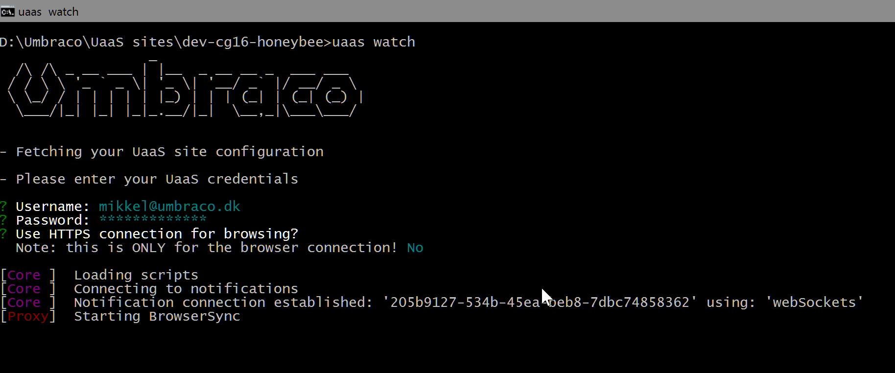

#Working with Umbraco Cloud and nodejs cli

One of the features built into Umbraco Cloud, is the ability to work locally with your Umbraco site, without having a Windows machine with a local web server installed on it. This enables i.e. people using a Mac to be using their favorite editor to modify code in their Umbraco Cloud site. The functionality requires that your machine has the following three tools installed

* A git client - In order to clone a site and push changes.
* Node.js (minimum version: 2.15) + npm installed in a command line of choice. 
* A code editor like Atom, Sublime or CS Code

To enable Node.js and npm you need to download the latest build from their site https://nodejs.org/en/download/. It is important to let the installer register itself to your PATH, so that the commands are available via your command line tool. 

The module you want to install is called uaas-cli, aka Umbraco Cloud Command line interface.
To install the module for globally use in node use

`npm install -g uaas-cli`

Use your git client to clone your Umbraco Cloud site locally. Once you have it locally, open your command line tool, and simply type the following command from within the (cloned) website.

`uaas watch`

This will start the module, type your credentials, and a local server will boot up, proxying the Umbraco Cloud site, enabling you to start using this approach. The server will pr. default run on port 3000. But your browser should automatically be opened at the address.

Now it is time to open your favorite code editor. The idea is that you are now able to change all front end files locally. By default we are watching the /css, /views /scripts and /images folders, everything you are changing in these folders will be synced between your local files and the Umbraco Cloud site. A change to any of the files will also auto refresh your local browser, so you can see the change immediately. The files are also synced back onto Umbraco Cloud, meaning that the change is visible there as well.

Changing content needs to be done through the development environment. Whenever you do change some content, we will notify your local running instance, and sync the content, meaning that your browser will get updated with this.
This flow enables you to do rapid frontend changes, and displaying them directly against the content on the Umbraco Cloud site.
